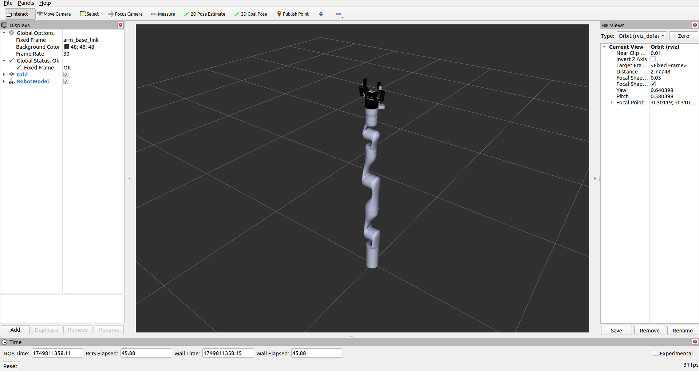
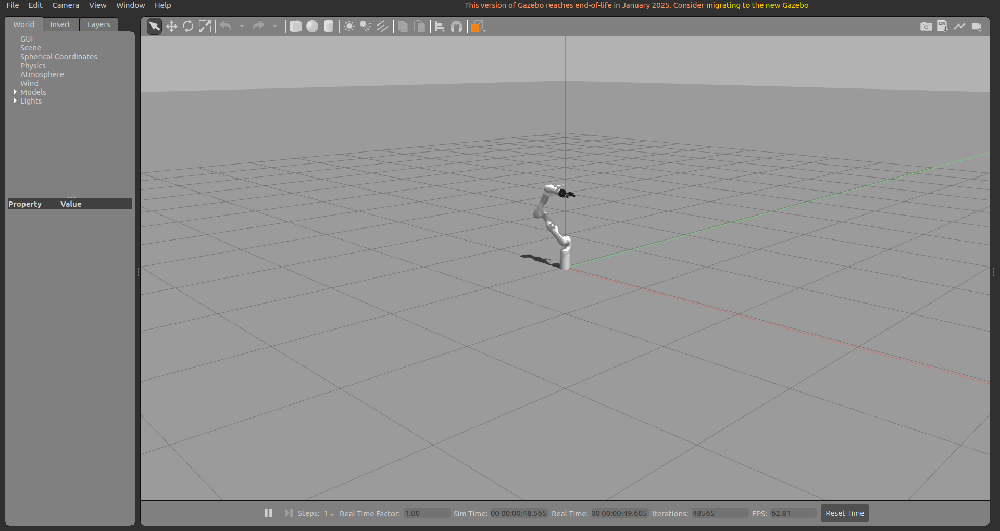
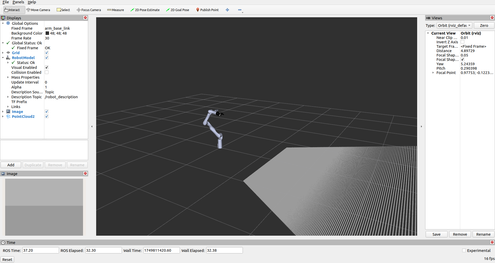
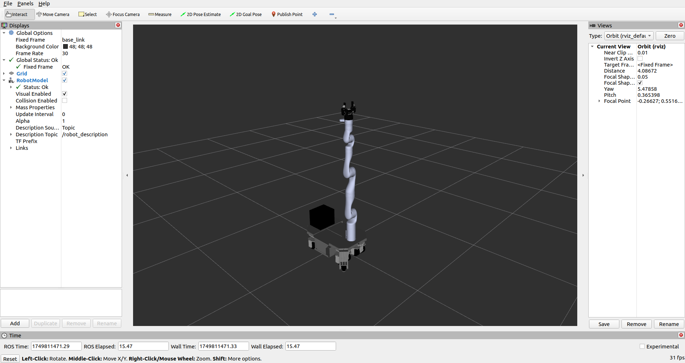
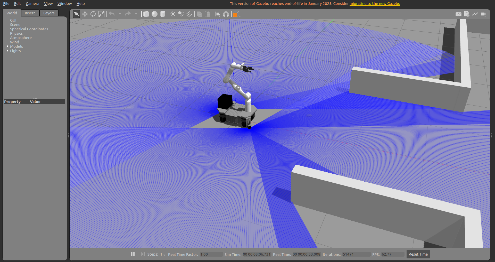
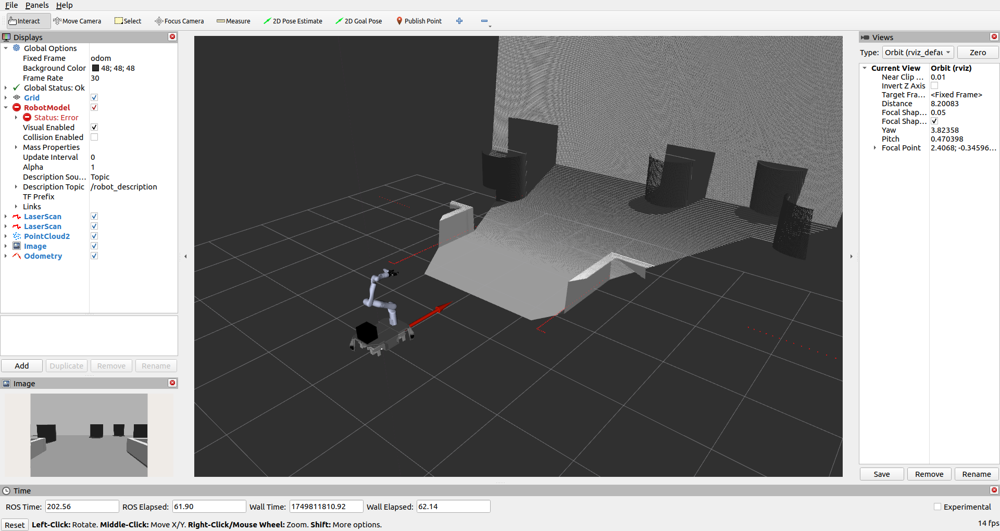
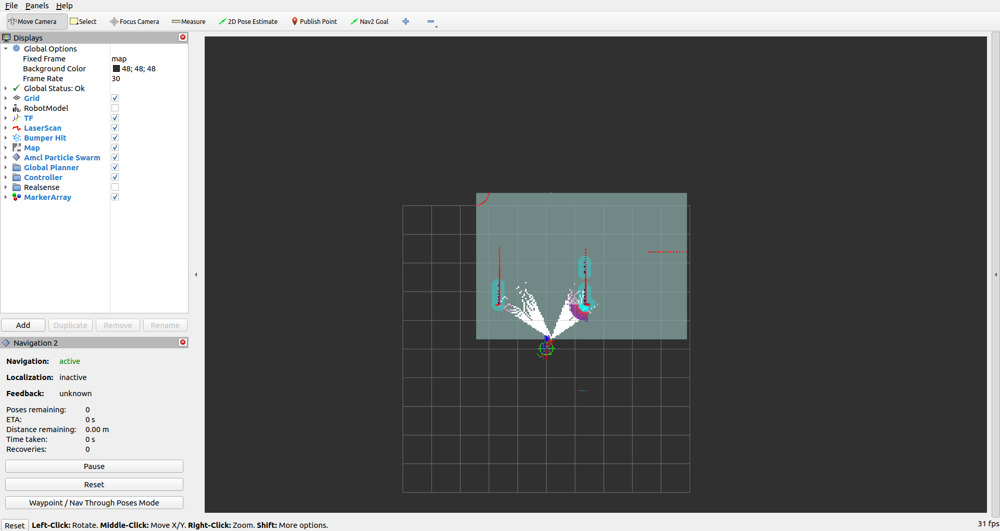

# 🤖 sKratch-Robot

## Overview
This repository is a **ROS 2 package** providing URDF descriptions and Gazebo configurations for the **Kinova robotic arm** integrated with the **Robotiq ARG85 gripper**, with full ROS 2 control support for both the arm and gripper. It also includes the **sKratch** robot platform with simulation support.

## Features
- Kinova robotic arm with Robotiq ARG85 gripper  
- ROS 2 control interfaces for arm and gripper  
- URDF and Gazebo simulation support  
- Navigation and mapping using ROS 2 Navigation2 (Nav2) and SLAM Toolbox  

## Purpose
The **sKratch** robot is a planned future platform for the **b-it-bots@Work** team to compete in the **RoboCup@Work League**. It is designed to replace the KUKA YouBot and offers a modular simulation environment for development and testing.

## Note ⚠️
Future development will focus on migrating the simulation environment to Gazebo Ignition Fortress.

## 📦 Prerequisites

Before using this repository, ensure the following ROS 2-related packages and tools are available in your workspace:

- `ros-humble-desktop` – Standard ROS 2 desktop install
- `gazebo_ros_pkgs` – Gazebo ROS integration
- `ros-humble-joint-state-publisher` – For visualizing robot states
- `ros-humble-robot-state-publisher` – Publishes TF transforms
- `ros-humble-xacro` – For processing XACRO files
- `ros-humble-rviz2` – For 3D visualization
- `ros-humble-nav2*` – For navigation stack (optional, if mapping is used)
- `ros-humble-slam-toolbox` – For SLAM in simulation
- `ros-humble-teleop-twist-keyboard` – For manual control (optional)

Make sure these packages are either sourced from your ROS 2 installation or added to your workspace using `rosdep`.

## Installation

Create a ROS 2 workspace
```
mkdir -p ~/sKratch_ws/src
cd ~/sKratch_ws/src
```
Clone the sKratch-Robot repository
```
git clone https://github.com/Chaitanya-Gumudala-1710/sKratch-Robot.git
```
Go back to the workspace root
```
cd ~/sKratch_ws
```
Source ros

```
source /opt/ros/humble/setup.bash
```

Build the workspace
```
colcon build
```

Source the workspace
```
source install/setup.bash
```

## Launching the Robot

### For launching Kinova arm
```
ros2 launch kinova_arm_description description.launch.py 
```


```
ros2 launch kinova_arm_gazebo simulation.launch.py 
```




### For launching the Scratch robot
```
ros2 launch skratch_description description.launch.py
```


```
ros2 launch skratch_gazebo simulation.launch.py 
```




## Running the Robot via Terminal Commands

### For Kinova arm

* In **Terminal-1,** launch the robot. 
```
ros2 launch kinova_arm_gazebo simulation.launch.py 
```
* In **Terminal 2,** echo ros topics
```
ros2 topic list
```
You should see these topics
```
/arm_camera/camera_info
/arm_camera/depth/camera_info
/arm_camera/depth/image_raw
/arm_camera/depth/image_raw/compressed
/arm_camera/depth/image_raw/compressedDepth
/arm_camera/depth/image_raw/theora
/arm_camera/image_raw
/arm_camera/image_raw/compressed
/arm_camera/image_raw/compressedDepth
/arm_camera/image_raw/theora
/arm_camera/points
/clicked_point
/clock
/dynamic_joint_states
/goal_pose
/initialpose
/joint_state_broadcaster/transition_event
/joint_states
/kinova_arm_controller/controller_state
/kinova_arm_controller/joint_trajectory
/kinova_arm_controller/state
/kinova_arm_controller/transition_event
/kinova_arm_gripper_controller/controller_state
/kinova_arm_gripper_controller/joint_trajectory
/kinova_arm_gripper_controller/state
/kinova_arm_gripper_controller/transition_event
/parameter_events
/performance_metrics
/robot_description
/rosout
/tf
/tf_static
```

For moving arm by specifying joint position
```
ros2 topic pub /kinova_arm_controller/joint_trajectory trajectory_msgs/msg/JointTrajectory  "{header: {stamp: {sec: 0, nanosec: 0}}, joint_names: ['shoulder_joint','half_arm_one_joint','half_arm_two_joint','fore_arm_joint','spherical_wrist_one_joint','spherical_wrist_two_joint','camera_joint'], points: [{positions: [0.0, 0.0, 0.0, 0.0, 0.0, 0.0, 0.0], time_from_start: {sec: 1, nanosec: 0}}]}"
```

For moving gripper by specifying joint position
```
ros2 topic pub /kinova_arm_gripper_controller/joint_trajectory trajectory_msgs/msg/JointTrajectory  "{header: {stamp: {sec: 0, nanosec: 0}}, joint_names: ['gripper_left_knuckle_joint'], points: [{positions: [0.0], time_from_start: {sec: 1, nanosec: 0}}]}"
```

### For skratch robot
* In **Terminal-1,** launch the robot. 
```
ros2 launch skratch_gazebo simulation.launch.py
```
* In **Terminal 2,** echo ros topics
```
ros2 topic list
```
You should see these topics
```
/arm_camera/camera_info
/arm_camera/depth/camera_info
/arm_camera/depth/image_raw
/arm_camera/depth/image_raw/compressed
/arm_camera/depth/image_raw/compressedDepth
/arm_camera/depth/image_raw/theora
/arm_camera/image_raw
/arm_camera/image_raw/compressed
/arm_camera/image_raw/compressedDepth
/arm_camera/image_raw/theora
/arm_camera/points
/clicked_point
/clock
/cmd_vel
/dynamic_joint_states
/goal_pose
/initialpose
/joint_state_broadcaster/transition_event
/joint_states
/kinova_arm_controller/controller_state
/kinova_arm_controller/joint_trajectory
/kinova_arm_controller/state
/kinova_arm_controller/transition_event
/kinova_arm_gripper_controller/controller_state
/kinova_arm_gripper_controller/joint_trajectory
/kinova_arm_gripper_controller/state
/kinova_arm_gripper_controller/transition_event
/lidar_front/out
/lidar_rear/out
/odom
/parameter_events
/performance_metrics
/robot_description
/rosout
/scan
/tf
/tf_static

```

For moving the robot, run ```teleop_twist_keyboard``` to move around in the simulation
```
ros2 run teleop_twist_keyboard teleop_twist_keyboard
```

## For mapping the environment

* In **Terminal-1**, launch robot in the simulation
```
ros2 launch skratch_gazebo simulation.launch.py
```
* In **Terminal-2**, launch mapping node. 
```
ros2 launch skratch_mapping mapping.launch.py 
```
After launching the mapping node, you should be able to see this


* In **Terminal-3**, run ```teleop-twist-keyboard``` to move robot in the simulation to map the environment
```
ros2 run teleop_twist_keyboard teleop_twist_keyboard
```